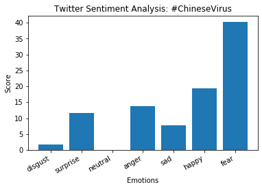

# PerspecTweet:baby_chick:

Analyses tweets according to various criteria (like keywords, hashtags, username, etc) and displays a bar graph having the score of 7 emotions:

- Disgust :nauseated_face:
-  Surprise :open_mouth:
-  Neutral :neutral_face:
-  Anger :angry:
- Sad :frowning_face:
- Happy :smile:
- Fear  :fearful:

For example, [#ChineseVirus](https://twitter.com/search?q=%23ChineseVirus&src=typeahead_click) was trending on Twitter. The following were the results obtained when 5000 tweets were analysed.

  

The program depends heavily on how a weight/score is assigned to each emotion for every word in [emotions](emotions.csv) file, which I obtained from [Kaggle](https://www.kaggle.com/iwilldoit/emotions-sensor-data-set), and thus the results may not always be accurate. 
